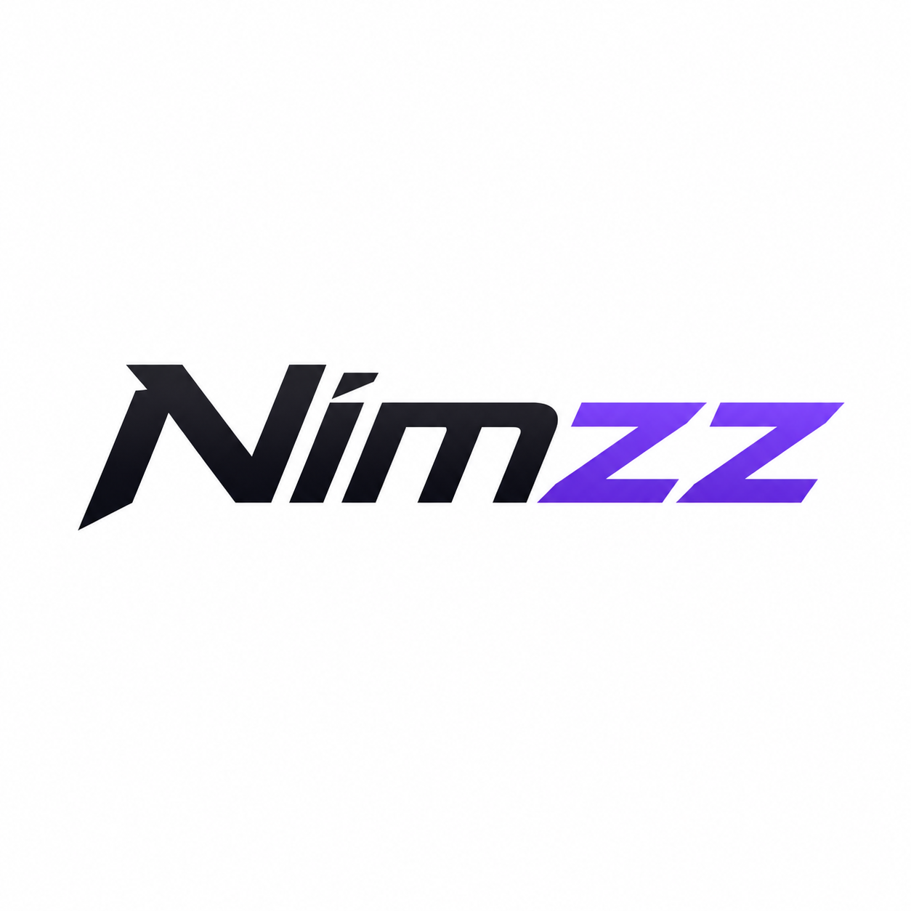

<div align="center">
  
  
  # Nimzz portofolio simple
  **The Ultimate Developer & Editor Portfolio**
  
  [](#)
  [](#)
  [](#)
  [](#)
</div>

---

> *"Membangun masa depan langsung dari genggaman smartphone."*

Selamat datang di repositori kode sumber untuk portofolio pribadi **Muhammad Na'im** (@Nimzz4) — Siswa Kelas X TKJ yang menulis kode dan melakukan *video editing* (Alight Motion). Website ini dirancang tanpa *framework* berat, mengutamakan performa *ultra-smooth*, gaya *Neo-Modern* yang *clean*, dan fitur interaktif tingkat lanjut.

## 🚀 Core Features

Portofolio ini bukan sekadar *linktree* biasa. Proyek ini mendemonstrasikan manipulasi DOM tingkat lanjut dan penggunaan Web API:

- 🌓 **Fluid Theme Engine:** Toggle Light/Dark mode menggunakan komponen *Segmented Control* dengan transisi kurva *Cubic-Bezier* yang super mulus.
- 🔋 **Hardware Integration:** Membaca status baterai perangkat (persentase & *charging state*) secara *real-time* menggunakan **Battery Status API**.
- 🕒 **Live Timezone:** Widget jam digital yang melakukan iterasi waktu per detik (*real-time*) dalam zona waktu WIB (Asia/Jakarta).
- 🎵 **Spotify-esque Player:** *Mini music player* fungsional dengan animasi *continuous wave spectrum* bergaya antarmuka Spotify.
- 🎥 **Rich Media Profile:** Mendukung *cinematic video loop* sebagai foto profil utama dengan sistem *fallback error handling* ke gambar statis.
- 💻 **Terminal IDE Mockup:** Representasi biodata dalam bentuk objek sintaks kode lengkap dengan *auto-syntax highlighting* yang menyesuaikan tema terang/gelap.

## 📂 Directory Architecture

Struktur hierarki folder untuk memastikan semua aset (*video, audio, icon*) dapat dirender secara sempurna oleh *browser*:

```text
📦 NIMZZ-PORTFOLIO
├── 📄 index.html        # Main entry point (Logic, Style, & DOM rendering)
├── 📄 README.md         # Project documentation
└── 📂 media             # Static assets directory
    ├── 🖼️ profile.jpg   # Fallback profile image
    ├── 🎥 profile.mp4   # Cinematic video profile (Optional)
    ├── 🎵 lagu.mp3      # Local audio track for the music player
    ├── 🖼️ album.jpg     # Music track cover art
    └── 🖼️ favicon.png   # Web icon & Apple Touch Icon (Displayed above)
    
